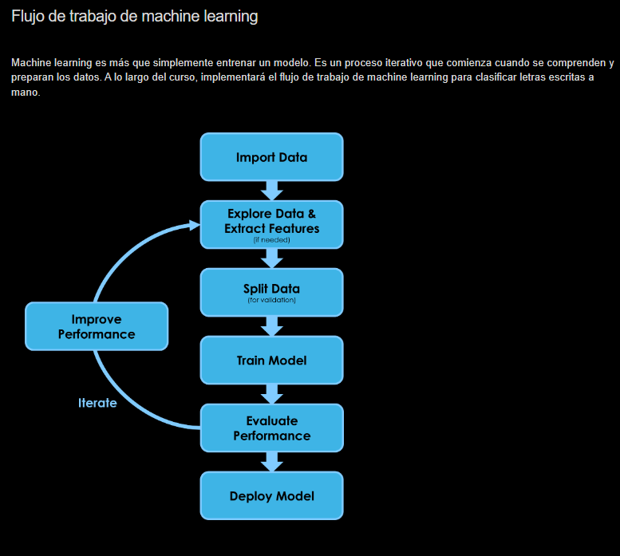

Aquí comienza el curso introductorio Machine Learning Onramp. Se habla mucho sobre machine learning, pero ¿qué es y por qué es tan importante?

En un nivel muy general, machine learning es un conjunto de técnicas para extraer información a partir de datos. Como usar un historial de compras para detectar fraudes con tarjetas de crédito, usar el estado de un equipo para predecir cuándo necesitará mantenimiento o usar la posición de un lápiz en una tableta a lo largo del tiempo para determinar qué se ha escrito.

En este curso, aprenderá a crear modelos de clasificación. Clasificación consiste en asignar una observación a un conjunto discreto de clases, como gato, perro o pingüino. Un modelo es solo un método matemático para convertir datos en una clase de salida.

En un enfoque de modelado tradicional, debe crear este método por su cuenta a partir del conocimiento sobre el funcionamiento del sistema. Pero muchos de los problemas del mundo real son demasiado complicados. Con machine learning, el modelo se crea a partir de los datos: se aplica un algoritmo de machine learning a los datos reales y la máquina aprende cómo asignar las entradas a las salidas deseadas.

En este curso, usará el ejemplo de la escritura manual para aprender el flujo de trabajo de clasificación completo. Importará los datos, extraerá información y luego la empleará para crear un modelo capaz de predecir con precisión la letra escrita.

No es necesario aprender mucha teoría para empezar a practicar machine learning, pero resultará útil saber los conceptos básicos de MATLAB. Si nunca ha usado MATLAB, es fácil comenzar. Recomendamos que primero complete el curso MATLAB Onramp para iniciarse rápidamente.

Durante el curso, utilizará una versión web de MATLAB dentro del entorno de formación. Tiene un aspecto ligeramente diferente al de MATLAB Online o MATLAB Desktop, pero utilizará exactamente el mismo lenguaje de MATLAB.

